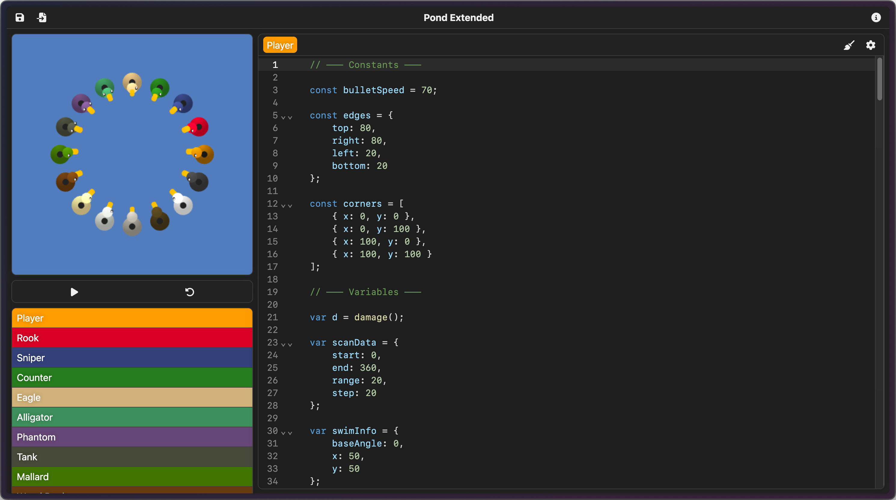
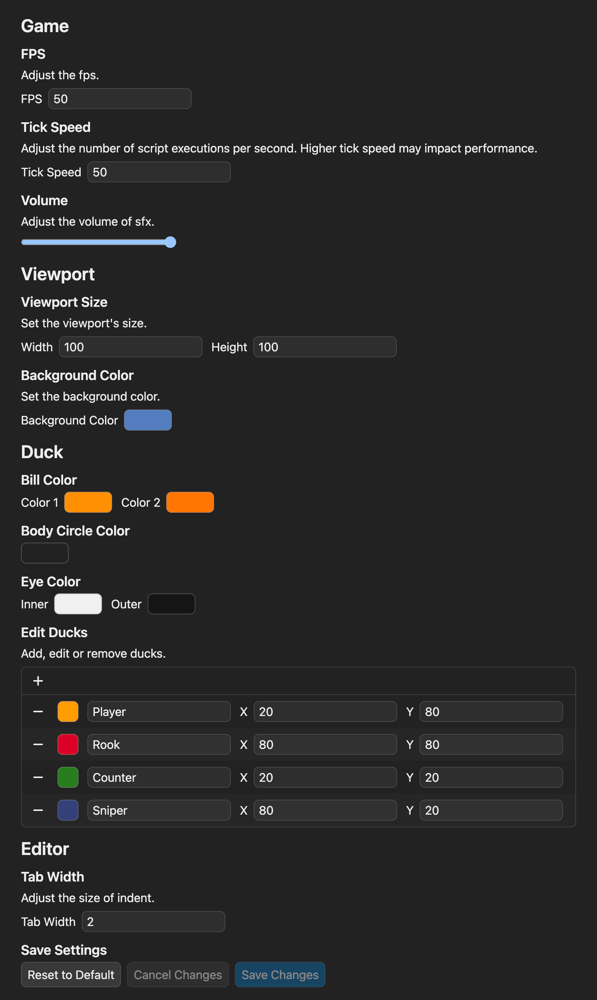

# Pond Extended

**Pond Extended** is an improved version of **Blockly Games's Pond** with additional features and enhancements.

Example Pond script can be found in [my repository](https://github.com/hatya-mouse/pond-examples/).

Play now at [https://pond-extended.vercel.app](https://pond-extended.vercel.app/)

## Features

- Add, edit, or remove ducks
- Assign custom scripts to each duck
- Customizable background and avatar color
- Adjustable arena size
- ...and more!

## Screenshots

| A refined user interface | Flexible settings |
| --- | --- |
|  |  |

## License

This project is licensed under the [**Apache License 2.0**](LICENSE), and free to use under the terms of use.

## Credits

This project is based on [Blockly Games - Pond](https://blockly.games/pond-duck), originally developed by **Google**.  
The original source code of Blockly Games is available under the [**Apache License 2.0**](https://www.apache.org/licenses/LICENSE-2.0) at [Blockly Games repository](https://github.com/google/blockly-games).

This project includes sound effects from [Freesound](https://freesound.org):

- **[water_splash.wav](https://freesound.org/people/soundscalpel.com/sounds/110393/)** by [soundscalpel.com](https://freesound.org/people/soundscalpel.com/) | License: [Attribution 3.0](http://creativecommons.org/licenses/by/3.0/)
- **[Exploding lightbulb 1](https://freesound.org/people/jorickhoofd/sounds/179265/)** by [jorickhoofd](https://freesound.org/people/jorickhoofd/) | License: [Attribution 4.0](https://creativecommons.org/licenses/by/4.0/)
- **[First person face punch 2](https://freesound.org/people/jorickhoofd/sounds/189158/)** by [jorickhoofd](https://freesound.org/people/jorickhoofd/) | License: [Attribution 4.0](https://creativecommons.org/licenses/by/4.0/)

This project uses icons from [Font Awesome](https://fontawesome.com).

## Third-party Modules

This project utilizes the following third-party libraries:

| Package | Description |
| -- | -- |
| [Next.js](https://nextjs.org/) | React framework for production |
| [React](https://react.dev/) | JavaScript library for building user interfaces |
| [CodeMirror](https://codemirror.net/) | In-browser code editor |
| [js-interpreter](https://github.com/NeilFraser/JS-Interpreter) | JavaScript interpreter written in JavaScript |
| [@babel/standalone](https://babeljs.io/) | Standalone build of Babel for browser usage |
| [react-color](https://casesandberg.github.io/react-color/) | Color picker component for React |
| [TypeScript](https://www.typescriptlang.org/) | JavaScript with syntax for types |
| [Tailwind CSS](https://tailwindcss.com/) | Easy-to-use CSS framework |

All other dependencies can be found in the `package.json` file.
